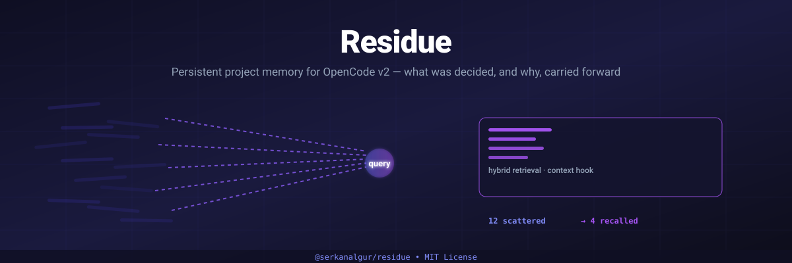

# Residue

<div align="center">



[](https://www.npmjs.com/package/@serkanalgur/residue)
[](https://www.npmjs.com/package/@serkanalgur/residue)
[](https://github.com/serkanalgur/residue/stargazers)
[](https://github.com/serkanalgur/residue/blob/main/LICENSE)
[](https://socket.dev/npm/package/@serkanalgur/residue/overview)
[](https://opencode.ai)
[](https://www.typescriptlang.org/)
[](https://github.com/sponsors/serkanalgur)

**Persistent, local-first project memory for OpenCode v2 — extracts decisions with their reasoning and recalls them on demand**

[Installation](#installation) • [Configuration](#configuration) • [How It Works](#how-it-works) • [Tools](#tools) • [Privacy & Security](#privacy--security) • [Differences from opencode-mem](#differences-from-opencode-mem) • [Development](#development) • [License](#license)

</div>

---

Persistent, local-first project memory for OpenCode V2.

Residue extracts atomic "decision + reason" facts from coding sessions and injects relevant notes into future model calls via context hooks. All data lives on disk in SQLite — no cloud, no sync, no vendor lock-in.

## Installation

```bash
npx opencode plugin add @serkanalgur/residue
```

## Configuration

Add the plugin to your `opencode.jsonc`:

```jsonc
// opencode.jsonc
{
  "plugins": [
    {
      "package": "@serkanalgur/residue",
      "options": {
        "autoCapture": true,
        "embedding": "auto",
        "inject": { "enabled": true, "maxChars": 2400, "maxFacts": 6, "minScore": 0.34 }
      }
    }
  ]
}
```

| Option | Default | Description |
|--------|---------|-------------|
| `autoCapture` | `true` | Automatically extract facts from conversations |
| `embedding` | `"auto"` | Embedding strategy: `auto`, `remote`, `ollama`, `local`, `none` |
| `embeddingKeyEnv` | `"OPENAI_API_KEY"` | Env var for the embedding API key |
| `dataDir` | `"xdg"` | Data location: `xdg` (XDG_DATA_HOME) or `project` (.opencode/residue/) |
| `inject.enabled` | `true` | Enable/disable context injection |
| `inject.maxChars` | `2400` | Maximum characters to inject per call |
| `inject.maxFacts` | `6` | Maximum facts to inject |
| `inject.minScore` | `0.34` | Minimum similarity score threshold |
| `inject.shareAcrossWorktrees` | `true` | Share facts across worktrees of the same project |
| `retention.enabled` | `true` | Enable automatic retention runs (TTL expiry, row cap enforcement) |
| `retention.maxRecordsPerProject` | `2000` | Max records per project. `0` = unlimited (no cap) |
| `retention.maxRecordsGlobal` | `5000` | Max records globally. `0` = unlimited (no cap) |
| `debug` | `false` | Enable debug logging |

> **Retention note**: Setting `maxRecordsPerProject` or `maxRecordsGlobal` to `0` disables that cap entirely (unlimited records). It does **not** mean "store zero records." If you want to prevent record capture, set `autoCapture: false` instead.

## How It Works

1. **Ingestion**: Listens to session events (`session.text.delta` feeds a turn buffer; `session.idle` triggers extraction). An LLM call extracts durable facts from the conversation.

2. **Storage**: Facts are stored in a local SQLite database with scope isolation (project + worktree). FTS5 enables full-text search; optional vector embeddings enable semantic search.

3. **Injection**: A `context` hook runs before every model call, retrieves relevant memories via hybrid search (lexical + vector with Reciprocal Rank Fusion), and injects them as `<recalled_notes>` system parts.

## Tools

Residue registers three tools under the `res` namespace:

- **`res_search`** — Hybrid memory search (FTS5 + vector via RRF)
- **`res_add`** — Manually add a memory record with provenance
- **`res_status`** — Plugin health, store status, embedder state

## Privacy & Security

- **Local-first**: All data stays on your machine in SQLite. No telemetry, no cloud sync.
- **Scope isolation**: Project records are isolated by project ID + worktree key. Cross-project leakage is prevented at the SQL level.
- **Secret redaction**: API keys, tokens, and sensitive file references are automatically redacted from extracted text before storage.
- **Provenance mandatory**: Records without a source (session ID + timestamp) are silently discarded.
- **Sub-agent guard**: `res_add` is removed for non-build agents to prevent sub-agents from polluting project memory.

## Differences from opencode-mem

| Feature | Residue | opencode-mem |
|---------|---------|--------------|
| Storage | SQLite (file-backed, WAL mode) | In-memory only |
| Search | Hybrid (FTS5 + vector with RRF) | Basic text match |
| Scope | Project + worktree isolation | Global only |
| Injection | Context hook with memoisation | N/A |
| Embedding | Auto/remote/ollama/local fallback | Fixed provider |
| Persistence | Survives restarts | Lost on restart |

## Development

```bash
bun install
bun run typecheck
bun test
bun run lint
```

## Community

- [Contributing](./CONTRIBUTING.md) — development setup, guidelines, and how to submit changes
- [Code of Conduct](./CODE_OF_CONDUCT.md) — standards for community participation
- [Security Policy](./SECURITY.md) — vulnerability reporting and security properties

## License

MIT — see [LICENSE](./LICENSE).
